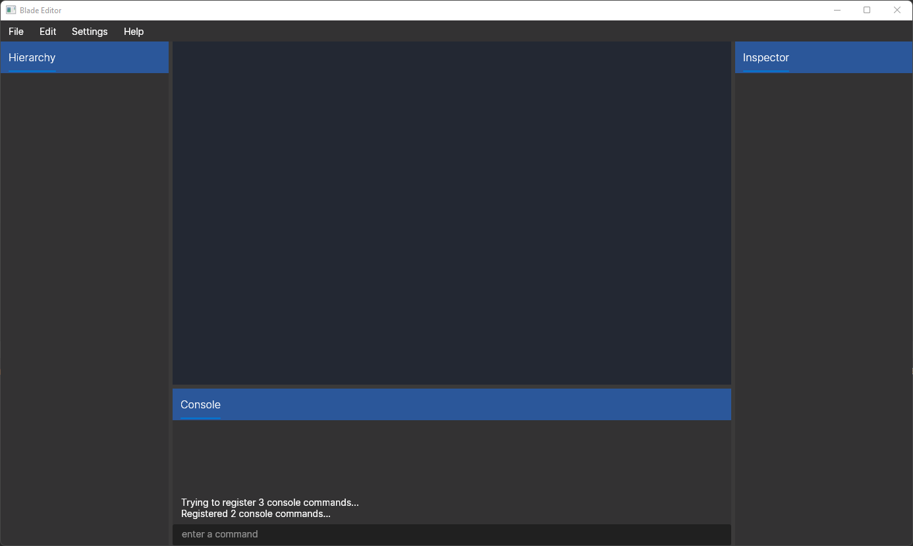

# Blade Engine

## Introduction
Blade is a general-purpose game engine written in C#.  
Blade was built from the ground up to give a seamless cross-platform experience, leveraging the power of .NET 6 and the Avalonia framework.

## Screenshots
There isn't much to see at the moment.

## Projects using Blade
None, it's not even out yet.